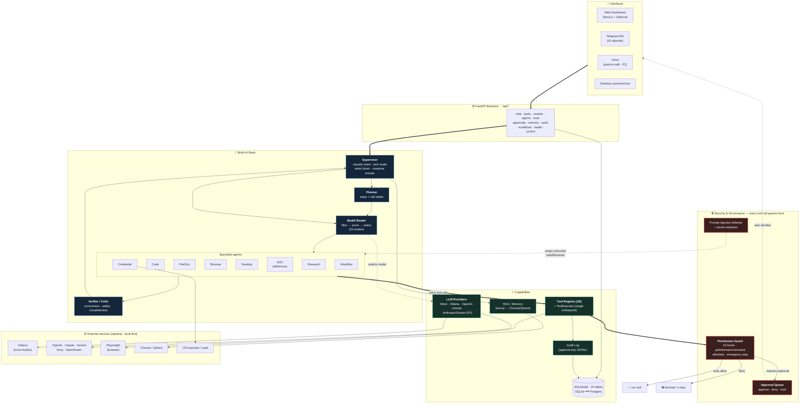

# JARVIS — Local-First Multi-AI Personal Automation Platform

A supervised team of AI agents that classify your command, plan it, route each
subtask to the best model (local **Ollama** by default, cloud optional), execute
**approved** actions through a typed/permissioned tool layer, verify the result,
and report back — over a web dashboard, Telegram, voice, or a desktop command bar.

> **Not a single chatbot.** 13 agents + a model router + an execution-mode engine
> (single/cascade/parallel/debate/verifier/deep-work/private/…) under one secure
> supervisor, with a human-in-the-loop Approval Queue and a redacted audit log.

This repo contains **Phase 1 (MVP), fully implemented and tested**, plus
scaffolding and design docs for Phases 2–4.

---

## 🏗️ Architecture (full overview)

The complete system in one view — interfaces, the multi-AI brain, the security
layer (every action passes the Permission Guard), the capability/tool layer, and
the optional external services. More views (request-lifecycle sequence,
model-router decision flow, execution modes) are in
[`docs/architecture.md`](docs/architecture.md).



**Read it in one line:** an interface sends a command → the **Supervisor**
classifies it and picks a mode → the **Model Router** chooses the best local/cloud
model(s) → the **Planner** breaks it into risk-labelled steps → **specialist
agents** execute, but **every tool call is gated by the Permission Guard** (auto,
approve, or deny) → the **Verifier** checks the result → the Supervisor composes
the final answer → everything is written to the **audit log**. Private mode keeps
it 100% local.

---

## 1. What was built (Phase 1)

| Area | Status |
|------|--------|
| FastAPI backend (`/api/*`) + lifespan + CORS | ✅ |
| Config (`pydantic-settings`), local-first defaults | ✅ |
| SQLModel schema — **25 tables** created on boot (SQLite default, Postgres opt) | ✅ |
| LLM provider abstraction + **Mock** (tests) + **Ollama** (local) | ✅ |
| Cloud providers (OpenAI/Groq/OpenRouter via OpenAI-compatible; Anthropic/Gemini stubs) | ✅ scaffold |
| **Model registry** (capability tags, seed models, health) | ✅ |
| **Model Router** (hard filters + scoring + modes; pure & unit-tested) | ✅ |
| Execution modes (single/cascade/parallel/specialist/debate/verifier/fast/deep/private/cost) | ✅ |
| Agents: Supervisor, Planner, Verifier + 6 specialists (research/code/file/browser/desktop/SOC) | ✅ |
| **Orchestrator** running the full lifecycle | ✅ |
| **Tool registry** (typed) + **29 tools** + **ToolExecutor** chokepoint | ✅ |
| **Permission Guard** (10 levels, allowlists, emergency stop) | ✅ tested |
| **Approval Queue** (async wait, approve/deny/trust) | ✅ tested |
| **Audit log** (append-only JSONL + secret redaction) | ✅ |
| **Prompt-injection defense** (untrusted wrapping + scanner) | ✅ |
| Local **RAG/memory** (dependency-free lexical retriever; Chroma/Qdrant later) | ✅ |
| **Telegram bot** scaffold (allowlist + commands + orchestrator) | ✅ |
| Credential manager (metadata + masking + approval hook) | ✅ |
| Next.js **dashboard** (chat, tasks, agents, models, approvals, tools, memory, workflows, audit, health) | ✅ |
| Docker Compose, `.env.example`, Makefile, bootstrap/health scripts | ✅ |
| **Tests** — 121 passing (permissions, router, tools, approvals, orchestrator, API, Phase 2) | ✅ |

### Phase 2 (in progress — see `docs/roadmap.md`)

| Area | Status |
|------|--------|
| Anthropic Messages API + Gemini generateContent wire formats (pure, tested) | ✅ |
| CASCADE / COST_SAVER escalation (verifier-gated; paid hop needs approval) | ✅ tested |
| SPECIALIST_TEAM multi-agent fan-out | ✅ tested |
| Browser controller (Playwright, lazy) + domain allowlist | ✅ tested |
| Credential vaults — `FernetVault` (encrypted, tested) + `KeyringVault` | ✅ |
| Desktop controller (Windows-first) — app allowlist + PowerShell gate | ✅ tested |
| Voice engines — faster-whisper STT + Piper TTS (lazy scaffold) | ✅ scaffold |
| Health-aware routing (`registry.available()` + TTL cache) | ✅ tested |
| Workflow execution engine + run API + dashboard Run button | ✅ tested |
| Persistence repository (tasks/approvals/audit/chat → SQLModel) | ✅ tested |
| Write-through persistence · SSE streaming · encrypted browser sessions | ✅ tested |
| Native token streaming · cron scheduler · voice command loop | ✅ tested |

### Phase 3 (in progress — see `docs/roadmap.md`, `docs/soc_modules.md`)

| Area | Status |
|------|--------|
| Document generation — Markdown + **DOCX/PDF/XLSX** (lazy libs) | ✅ tested |
| **SOC** (defensive): Event ID explainer, ATT&CK mapping, Splunk/LogScale/Sigma | ✅ tested |
| GitHub README/scaffold generator (+ approval-gated REST client) | ✅ tested |
| Email draft composer + RFC-5545 ICS calendar builder | ✅ tested |
| WhatsApp Cloud API (official) payload builders + client scaffold | ✅ tested |
| n8n webhook payload + trigger client scaffold | ✅ tested |

The core and the **entire test suite run with only Python + SQLite + the mock
provider** — no Ollama, no Postgres, no API keys required.

---

## 2. Folder structure

```
jarvis/
├── backend/app/
│   ├── main.py config.py database.py deps.py
│   ├── agents/        supervisor, planner, verifier, specialists, orchestrator, base
│   ├── api/           routes.py  (all /api endpoints)
│   ├── audit/         logger.py  (redacted append-only log)
│   ├── llm/           base, mock_provider, ollama_provider, cloud_providers, registry
│   ├── model_router/  modes.py, router.py
│   ├── models/        tables.py  (25 SQLModel tables)
│   ├── rag/           memory.py
│   ├── schemas/       api.py
│   ├── security/      permissions.py, prompt_injection.py, credentials.py
│   ├── services/      container.py (the "Brain"), approvals.py, tasks.py
│   ├── telegram/      bot.py
│   ├── tools/         base.py, executor.py, builtin/builtin.py
│   ├── workflows/     definitions.py
│   └── tests/         test_permissions/model_router/tools/approvals/orchestrator/api
├── frontend/          Next.js 14 dashboard (app router + Tailwind)
├── docs/              architecture, multi_ai_design, model_router, agent_design,
│                      security_model, credential_model, threat_model, telegram_setup,
│                      voice_setup, browser_automation, workflow_automation, roadmap
├── docker/            backend.Dockerfile
├── scripts/           bootstrap.sh, bootstrap.ps1, healthcheck.sh
├── docker-compose.yml  Makefile  .env.example  .gitignore  README.md
```

---

## 3. Setup commands

```bash
# One-shot local setup (venv + deps + .env + tests)
./scripts/bootstrap.sh           # Linux/macOS
# or
powershell -File scripts\bootstrap.ps1   # Windows

# Or with Make:
make setup        # venv + deps + .env
make test         # run tests
make run          # start API at http://localhost:8000  (docs at /docs)
```

Manual:
```bash
python3 -m venv backend/.venv && source backend/.venv/bin/activate
pip install -r backend/requirements.txt
cp .env.example .env
cd backend && uvicorn app.main:app --reload
```

Frontend:
```bash
cd frontend && npm install && npm run dev   # http://localhost:3000
```

---

## 4. `.env` configuration

Copy `.env.example` → `.env`. Local-first defaults work with **no keys**. Key knobs:

- `OLLAMA_BASE_URL` — local model server (default `http://localhost:11434`).
- `ALLOWED_PATHS` / `ALLOWED_DOMAINS` — security allowlists for file/browser tools.
- `COMMAND_ALLOWLIST` / `COMMAND_BLOCKLIST` — terminal safety.
- `ALLOW_LOW_RISK_WRITE` — auto-run note/report creation (else they need approval).
- `OPENAI_API_KEY` / `ANTHROPIC_API_KEY` / `GOOGLE_API_KEY` / `GROQ_API_KEY` /
  `OPENROUTER_API_KEY` — optional; enabling a provider activates its models.
- `TELEGRAM_ENABLED` / `TELEGRAM_BOT_TOKEN` / `TELEGRAM_ALLOWED_USER_IDS` — Telegram.

---

## 5. Telegram bot setup

See `docs/telegram_setup.md`. Short version:
1. `@BotFather` → `/newbot` → copy the token.
2. `@userinfobot` → copy your numeric user ID.
3. In `.env`: `TELEGRAM_ENABLED=true`, `TELEGRAM_BOT_TOKEN=…`,
   `TELEGRAM_ALLOWED_USER_IDS=<your id>`, and `pip install python-telegram-bot`.
4. Restart the backend. Only allowlisted IDs are served. Commands: `/start /status
   /tasks /approve /deny /mode /models /agents /memory /screenshot /help`.

---

## 6. Ollama model setup

```bash
# Install Ollama from https://ollama.com, then:
make seed-ollama        # pulls llama3.1, qwen2.5-coder, mistral
# or individually:
ollama pull llama3.1
ollama pull qwen2.5-coder
ollama pull deepseek-coder-v2
```
The seed registry references these; edit `backend/app/llm/registry.py` to match
the exact tags you pulled.

---

## 7. Run with Docker Compose

```bash
docker compose up -d backend            # minimal: SQLite + in-memory (no infra)
docker compose --profile full up -d     # + Postgres, Redis, Qdrant, Ollama
docker compose --profile ui up -d       # + Next.js dashboard on :3000
```
Backend health: `curl localhost:8000/api/health`.

---

## 8. How to test

```bash
make test
# or
cd backend && .venv/bin/python -m pytest -q
```
Covers: permission guard, model router, tool registry + executor, approval queue
(incl. async approve/deny/timeout), the orchestrator across modes, and the HTTP
API. All hermetic via the mock provider — **59 tests, no network**.

---

## 9. How to use multi-AI modes

Drive modes from natural language or the dashboard dropdown / Telegram `/mode`:

| Say… | Mode |
|------|------|
| "fast: …", "quick", "do it now" | `FAST_MODE` (smallest local model, skips planning) |
| "deep work", "world-class", "best possible", "use multiple AI" | `DEEP_WORK_MODE` (planner + ≥2 models + verifier, saves to memory) |
| "private", "local only", "offline" | `PRIVATE_MODE` (local models only; cloud + net blocked) |
| "compare X and Y" | `PARALLEL_MODE` (N models, agreement compare) |
| "debate …" | `DEBATE_MODE` (N propose, verifier judges) |
| "verify", "double-check" | `VERIFIER_MODE` (worker + critic) |
| "save cost", "cheap" | `COST_SAVER_MODE` (local first, cloud on approval) |

```bash
curl -s localhost:8000/api/chat -H 'content-type: application/json' \
  -d '{"message":"deep work: design a SOC lab", "mode":"DEEP_WORK_MODE"}' | python3 -m json.tool
```

---

## 10. Security notes

- **Local-first / private by default.** `PRIVATE_MODE` never calls cloud or the
  network — enforced in the router *and* the permission guard.
- **Human-in-the-loop.** Browser-write, desktop-control, terminal-write,
  credential use, and anything irreversible/high-risk **always** require approval.
  File deletion, sending messages, purchases, and account changes are hard-gated.
- **Allowlists.** Path, domain, and command allow/blocklists; traversal/escape
  rejected. Tools run only through the `ToolExecutor` → the guard can't be bypassed.
- **Emergency stop.** `POST /api/control/stop {"engaged":true}` (or dashboard) —
  blocks every non-`SAFE_READ` action instantly.
- **Prompt-injection defense.** External content is wrapped as untrusted data and
  can never change rules; a scanner raises the approval bar on flagged steps.
- **Secrets.** Metadata only in the DB; values in keychain/vault (Phase 2); masked
  in UI; redacted from logs/audit. No secrets in tests.
- **SOC agent is defensive-only** — refuses exploitation/malware/evasion; helps
  with detection engineering, log analysis, IR docs, and MITRE ATT&CK mapping.

See `docs/security_model.md` and `docs/threat_model.md`.

---

## 11. Next prompt for Phase 2

> Implement Phase 2 of JARVIS on top of the Phase 1 codebase:
> 1. **Live cloud providers** — finish `AnthropicProvider` (Messages API) and
>    `GeminiProvider` (Generative Language API); add streaming; wire model health
>    into the router's availability filter and `model_evaluations` performance.
> 2. **Execution modes** — implement real `CASCADE`/`COST_SAVER` escalation
>    (verifier-gated, approval on paid hop) and `SPECIALIST_TEAM` multi-agent
>    fan-out with the planner driving tool calls through the `ToolExecutor`.
> 3. **Voice** — `faster-whisper` STT + Piper TTS, push-to-talk, voice confirmation
>    reusing the approval queue; persist `voice_sessions`.
> 4. **Browser** — real Playwright `BrowserController` (persistent profiles,
>    domain allowlist, screenshots, download monitoring, MFA/CAPTCHA pause).
> 5. **Credentials** — `keyring` + Fernet vault backends and encrypted Playwright
>    `storage_state`; approval-gated `request_use`.
> 6. **Desktop** (Windows-first) — open apps, clipboard, move-in-workspace,
>    screenshots, approved PowerShell (allowlist).
> 7. **Persistence** — move the in-memory runtime stores (tasks/approvals/audit/
>    memory) onto the SQLModel tables; add Arq + Redis for background tasks and
>    workflow scheduling.
> Keep local-first operation and all Phase 1 tests green; add tests for each new
> capability with mocks (no real external actions).
