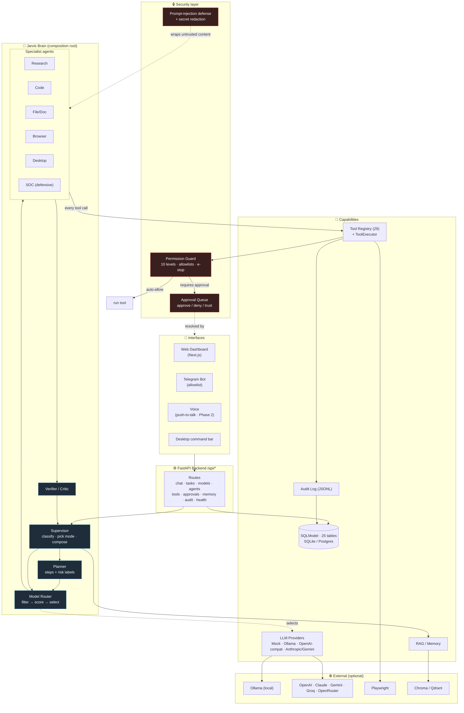
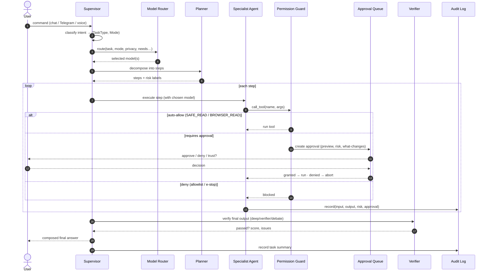
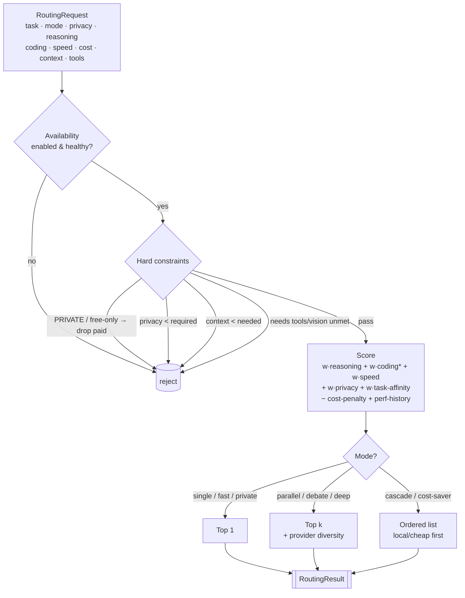
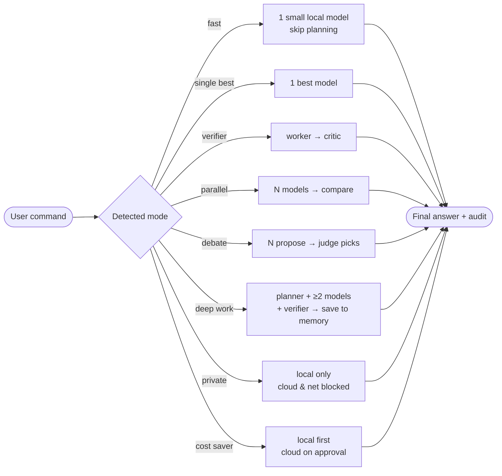

# JARVIS — Architecture Summary

JARVIS is a **local-first multi-AI personal automation platform**. It is not a
single chatbot: it is a supervised team of AI agents that classify a command,
plan it, route each subtask to the best model, execute *approved* actions
through a typed/permissioned tool layer, verify the result, and report back —
over a web dashboard, Telegram, voice, or a desktop command bar.

## Design principles

1. **Local-first / private by default.** The system runs end-to-end on local
   Ollama models with no paid API. Cloud providers are strictly optional and are
   never called in `PRIVATE_MODE`.
2. **Everything risky needs a human.** A central Permission Guard + Approval
   Queue gates every tool call by risk level. The LLM never gets to bypass it.
3. **Untrusted content stays untrusted.** Web pages, emails, files, and external
   messages can never issue commands. Prompt-injection defense is structural,
   not prompt-based.
4. **Auditable.** Every agent run, model call, and tool call is written to an
   append-only audit log with input/output summaries and screenshot references.
5. **Typed contracts.** Models, agents, tools, and tasks all have explicit
   Pydantic schemas. The router and guard operate on data, not free text.

## High-level component map

```
                         ┌──────────────────────────────────────────┐
  Interfaces             │  Web Dashboard   Telegram   Voice   CLI    │
                         └───────────────┬──────────────────────────┘
                                         │ (chat API / webhook)
                         ┌───────────────▼──────────────────────────┐
                         │            FastAPI Backend                │
                         │                                           │
  Brain / orchestration  │   Supervisor → Planner → Router → Agents  │
                         │        │           │         │            │
                         │   Risk Engine   Model      Specialist     │
                         │        │        Registry    Agents        │
                         │   Permission Guard ─────────► Verifier    │
                         └───┬───────────┬──────────┬────────┬───────┘
                             │           │          │        │
                    ┌────────▼──┐  ┌─────▼────┐ ┌───▼────┐ ┌─▼──────┐
  Capabilities      │ Tool      │  │ LLM      │ │ RAG /  │ │ Audit  │
                    │ Registry  │  │ Providers│ │ Memory │ │ Log    │
                    └────┬──────┘  └─────┬────┘ └───┬────┘ └────────┘
                         │               │          │
              ┌──────────┼───────┐  ┌────┴────┐ ┌───┴────┐
              │ files browser    │  │ Ollama  │ │ Chroma │
              │ desktop memory   │  │ OpenAI… │ │ Qdrant │
              └──────────────────┘  └─────────┘ └────────┘
```

## Architecture diagrams (rendered)

> These Mermaid diagrams render automatically on GitHub. They are the canonical
> architectural view; the ASCII map above is a quick text fallback.

### 1. System / component view



### 2. Request lifecycle (non-trivial task)



### 3. Model-router decision flow



### 4. Execution modes at a glance




## Request lifecycle (non-trivial task)

1. User sends a command (dashboard / Telegram / voice).
2. **Supervisor** classifies intent → `TaskType` + execution `Mode`.
3. **Model Router** selects the best model (or team) given task, privacy, mode,
   reasoning/coding/speed needs, context length, tool support, availability.
4. **Planner** decomposes the task into ordered `TaskStep`s.
5. **Risk Engine** labels every step with a `PermissionLevel` + `RiskLevel`.
6. **Permission Guard** decides: auto-run, run-if-enabled, or require approval.
7. Specialist agents execute auto-approved steps via the **Tool Registry**.
8. Risky steps create an **Approval** and pause until the human approves/denies.
9. **Verifier** checks the final output for correctness, safety, completeness.
10. **Supervisor** composes the final answer.
11. **Audit log** persists every step, model call, and tool call.

## Local-first stack

| Concern        | Default (local)        | Optional / scale-up           |
|----------------|------------------------|-------------------------------|
| LLM            | Ollama                 | OpenAI/Claude/Gemini/Groq/OR  |
| DB             | SQLite (`jarvis.db`)   | PostgreSQL                    |
| Queue          | in-process async       | Redis + Arq/Celery            |
| Vector memory  | in-memory / Chroma     | Qdrant                        |
| Browser        | Playwright (headed)    | headless / persistent profile |

The MVP runs with **only Python + SQLite + a mock or Ollama provider** — no
external service is required to start, develop, or run the test suite.

See the companion docs: `multi_ai_design.md`, `model_router.md`,
`agent_design.md`, `security_model.md`, `credential_model.md`, `threat_model.md`,
`browser_automation.md`, `workflow_automation.md`, `telegram_setup.md`,
`voice_setup.md`, `roadmap.md`.
