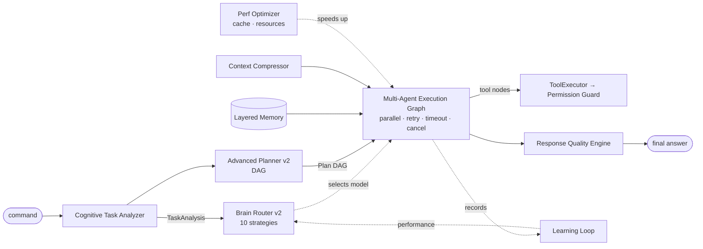

# Cognitive Processing Engine v2

An **additive** brain-and-processing upgrade (`app/brain/`, `app/soc/brain.py`).
It does **not** touch the Permission Guard, ToolExecutor, approval rules, or the
local-first default — every tool action still flows through
`ToolExecutor → PermissionGuard`, risky actions still require approval, and
`PRIVATE_MODE` still never calls the internet or cloud models.

## Cognitive pipeline



## Modules (all typed, all tested)

| Module | File | What it adds |
|--------|------|--------------|
| **Cognitive Task Analyzer** | `brain/analyzer.py` | `TaskAnalysis` (intent, type, risk, complexity, skills, tools, models, format, privacy, cloud_allowed, background/parallel hints, verifier_mandatory, mode). |
| **Brain Router v2** | `brain/router_v2.py` | 10 strategies (fastest_good_enough, best_reasoning, best_coding, best_private, best_soc, cheapest_safe, ensemble_consensus, local_then_cloud_escalation, verifier_gated_escalation, long_context_mode) over the existing ModelRouter — preserves all privacy/health constraints. |
| **Advanced Planner v2** | `brain/planner_v2.py` | Machine-readable `Plan` DAG; tool-node permissions/approvals resolved from the real Tool Registry; DAG validation. |
| **Execution Graph** | `brain/graph.py` | Async parallel-wave DAG execution; tool nodes via ToolExecutor (guard-gated); retry/fallback, per-node timeout, cancellation, partial-recovery, per-node audit. |
| **Layered Memory** | `brain/memory_v2.py` | working/episodic/semantic/procedural/preference/soc layers; privacy-scoped, relevance+freshness+trust scoring; summarization. |
| **Context Compressor** | `brain/context.py` | Compact ContextPack; trusted vs untrusted separation; dedupe; secret redaction; budget enforcement. |
| **Quality Engine** | `brain/quality.py` | Deterministic pre-final pass (completeness, format, safety, citations, clarification). |
| **Learning Loop** | `brain/learning.py` | `TaskFeedback` → composite score → EvaluationStore → router performance; leaderboard. No auto-training on private data. |
| **Perf Optimizer** | `brain/performance.py` | ResponseCache (LRU+TTL) + `cached_complete`, EmbeddingCache, ResourceMonitor (CPU/RAM/GPU → max parallel + degradation), OllamaTuner. |
| **Processing Queue** | `brain/queue.py` | Async background worker; states queued/running/waiting_for_approval/paused/completed/failed/cancelled; cancel + retry. |
| **SOC Brain** | `soc/brain.py` | Triage, FP analysis, YARA, brute-force/spray/DNS-tunneling logic, web-attack analysis, incident summary (defensive-only). |
| **Benchmarks** | `brain/benchmarks.py`, `benchmarks/run.py` | Routing/planning/guard/injection/memory/SOC suites. |

## API (`/api/brain/*`)

```
POST /api/brain/analyze            {command}            -> TaskAnalysis
POST /api/brain/plan               {command, strategy?} -> {analysis, strategy, plan(DAG)}
POST /api/brain/execute            {command, background?} -> graph run (or job id)
GET  /api/brain/status                                  -> resources, cache, memory, queue
POST /api/brain/memory/search      {query, layers?, for_cloud?}
POST /api/brain/evaluate           {TaskFeedback}       -> updated performance
GET  /api/brain/models/health                           -> health + leaderboard
GET  /api/brain/queue                                   -> jobs
GET  /api/brain/graph/{task_id}                         -> stored graph run
POST /api/brain/benchmarks/run                          -> benchmark report
```

## Example

```bash
# Plan a task as a DAG
curl -s localhost:8000/api/brain/plan -H 'content-type: application/json' \
  -d '{"command":"research local LLMs and write a verified report"}' | python3 -m json.tool

# Execute it as a multi-agent graph (guard-gated)
curl -s localhost:8000/api/brain/execute -H 'content-type: application/json' \
  -d '{"command":"research AI and reason about it"}'

# Run the benchmark suite
python backend/benchmarks/run.py
```

## Security invariants (unchanged)

- Tool nodes execute **only** through `ToolExecutor` → `PermissionGuard`.
- Risky nodes (browser-write, desktop, credential, terminal-write, irreversible,
  HIGH_RISK) return `requires_approval` and pause for the human.
- Untrusted content stays wrapped; secrets redacted; high-privacy memory withheld
  from cloud models; `PRIVATE_MODE` blocks network/cloud.
- SOC brain is defensive-only (detection/analysis), no offensive tooling.
